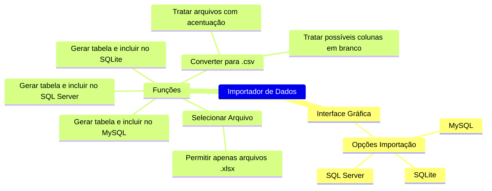

## Estrutura do Importador de Dados

> ### Legenda
> * Se Tópico Principal identificado com "OK"
>     * Todos os ramos estão concluídos
> * Se não:
>     * Apenas os ramos identificaods com "OK" estão concluídos

* 1 - Interface Gráfica - OK
    * 1.1 - Opções Importação
        * 1.1.1 - SQLite
        * 1.1.2 - MySQL
        * 1.1.3 - SQL Server
    * 1.2 - Selecionar Arquivo
        * 1.2.1 - Permitir apenas arquivos .xlsx
* 2 - Funções
    * 2.1 - Converter para .csv                      - Parcial
        * 2.1.1 - Tratar arquivos com acentuação     - OK
        * 2.1.2 - Tratar possíveis colunas em branco - Pendente
    * 2.2 - Gerar tabela e incluir no SQLite         - Parcial 
    * 2.3 - Gerar tabela e incluir no MySQL          - Parcial
    * 2.4 - Gerar tabela e incluir no SQL Server     - Parcial
    
* 3 - Melhorias
    
